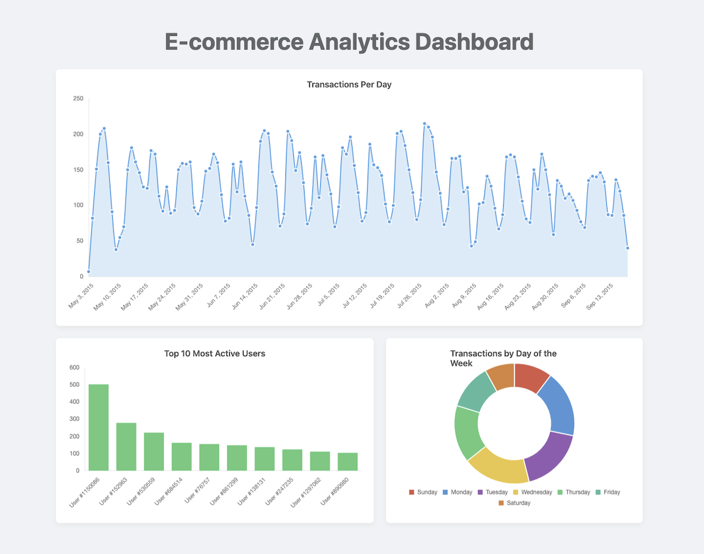

# E-Commerce Analytics Batch Processing Pipeline 🚀

**End-to-end batch processing pipeline transforming raw clickstream data into actionable business insights via an interactive web dashboard.**

This project implements a complete, end-to-end **batch processing pipeline** for e-commerce analytics. It transforms raw clickstream data into clean, aggregated datasets ready for **reporting and decision-making**, culminating in an interactive web dashboard. The workflow integrates **Python, SQL, dbt, AWS S3, and Flask** to showcase full-stack data engineering capabilities.

## 📊 Interactive Dashboard Preview

The final output is a **live analytics dashboard** built with Flask and Chart.js, visualizing key business metrics directly from the transformed data.

  

---

## 📌 Key Features & Contributions

* **Data Ingestion & Cloud Storage**

  * Developed `upload_to_s3.py` to simulate **daily ingestion** of raw clickstream data (`events.csv`) into a structured **AWS S3 data lake**.

* **Data Transformation & Modeling**

  * Built robust **Python-based staging models** (`stg_events.py`) to clean and normalize raw event data.
  * Developed **SQL-based data marts** for `transactions`, `users`, and `products`, transforming staged data into **analysis-ready dimensional models**.
  * Applied aggregations to derive metrics like **daily transactions, user activity, and product interactions**.

* **Data Quality Assurance**

  * Implemented dbt `schema.yml` tests to enforce **NOT NULL** and **UNIQUE** constraints.
  * Diagnosed and resolved **duplicate transaction IDs**, demonstrating a full **data debugging cycle**.

* **Data Export for Downstream Use**

  * Created `export_to_s3.py` to export clean tables from **DuckDB** back to AWS S3 for further consumption by other teams.

* **Interactive Analytics Dashboard**

  * Built a lightweight **Flask API** to serve transformed data.
  * Developed an **interactive frontend** using HTML, CSS, and Chart.js to visualize key business metrics in real-time.

---

## 🛠️ Technology Stack

* **Backend & Scripting:** Python
* **Cloud Storage:** AWS S3
* **Data Transformation & Modeling:** dbt, SQL
* **Data Warehouse:** DuckDB
* **Web Framework:** Flask
* **Frontend Visualization:** Chart.js, HTML, CSS
* **Version Control:** Git / GitHub

---

## 🔄 Project Architecture & Flow

The pipeline follows a **multi-stage workflow** from raw data ingestion to interactive analytics.

---

##  Outcome & Impact

* Delivered a **full end-to-end batch processing pipeline**, demonstrating proficiency across the modern data engineering lifecycle.
* Built a **robust, scalable, and maintainable workflow** from raw ingestion to interactive dashboard.
* Showcased the ability to integrate **cloud storage, modern data warehouses, transformation tooling, and web development frameworks**.
* Created a **portfolio-ready project** highlighting technical skills in **Python, dbt, AWS, DuckDB, and Flask**.
* Enabled **actionable business insights** through clean, aggregated datasets and an interactive web dashboard, demonstrating the practical impact of the pipeline.
